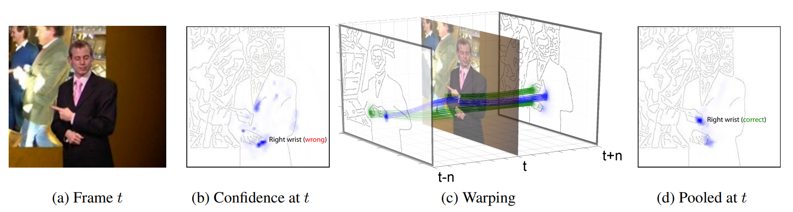
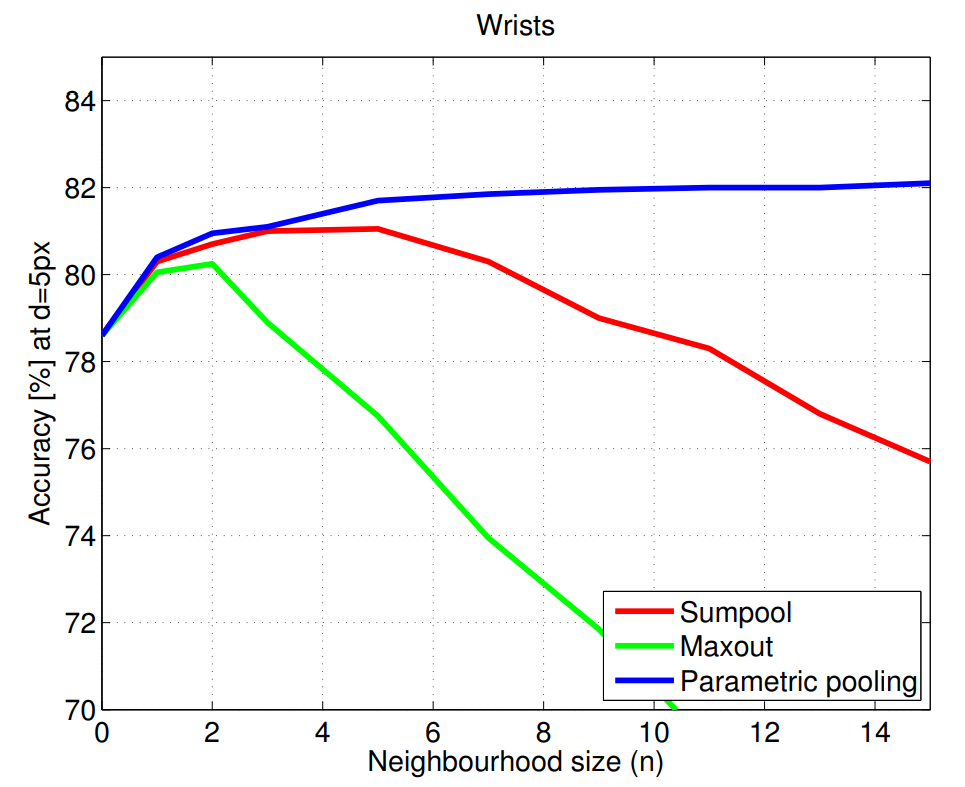
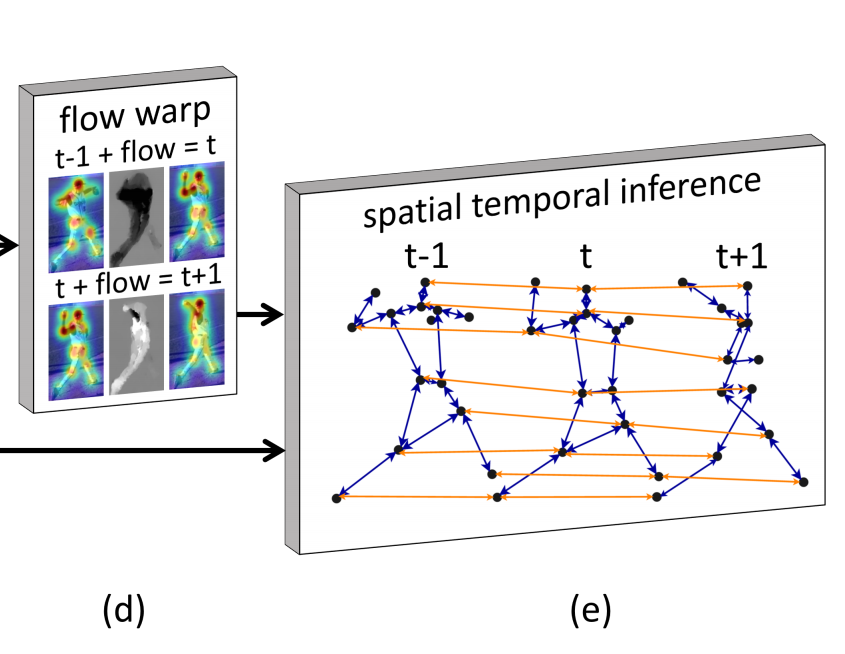
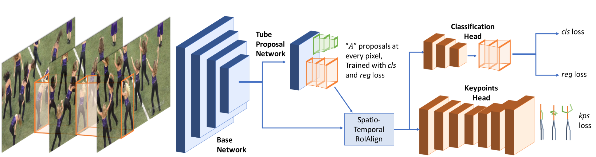

## ICCV-2015 Flowing ConvNets for Human Pose Estimation in Videos

主要使用光流来提高估计的准确度。首先得到$[t-n,t+n]$帧关节k的热力图，然后计算$[t-n,t+n]$中所有帧到第t帧的光流，然后利用光流将其他帧的热力图和第t帧的对齐。记$w_{t+1\rightarrow t}$为第t+1帧到第t帧的光流，那么$H_{t+1}$根据光流对齐后的热力图可以表示为
$$
\hat{H}_{t+1}(x,y)=H_{t+1}(x-w_x^{t+1\rightarrow t},y-w_y^{t+1\rightarrow t})
$$
最后经过一个$1*1$的卷积（也就是通道上的加权平均）得到第t帧关节k的热力图。并且实验从下图的实验结果中可以发现，使用这种pooling的效果更好，而且随着n的增加效果稳步提升。

## CVPR-2017 Thin-Slicing Network: A Deep Structured Model for Pose Estimation in Videos

本文把姿势估计分解成两个子问题，分别是Spatial Consistency和Temporal Consistency。对于Spatial Consistency，作者通过以下公式建模：
$$
S(I,p)=\sum_{i\in V}{\phi_i(p_i|I)}+\sum_{(i,j)\in E_s}{\psi_{i,j}(p_i,p_j)}
$$
首先我们把关节点按照骨骼连接起来，当作一张图，每个关节点就是一个节点，节点的集合表示为$V$，每根骨骼就是一条边，边的集合表示为$E_s$（这里的下标s表示Spatial），$p_i$表示关节点$i$，那么关节点估计可以转化为最小化上式。

$\phi_i(p_i|I)$用来表示给定输入图片$I$，$p_i$是第$i$个关节点位置的概率（ `confidence values of part i based on the local appearance`），这里的$\phi_i$用卷积神经网络来估计；$\psi_{i,j}(p_i,p_j)$表示的是关节点$i$和关节点$j$的匹配程度，这里利用`spring energy model`建模，可表示为
$$
\begin{align*}
\psi_{i,j}(p_i,p_j)&=w_{i,j}\cdot d(p_i-p_j)\\
&=w_{i,j}\cdot [\Delta x\ \Delta x^2\ \Delta y\ \Delta y^2]^T
\end{align*}
$$
其中$w_{i,j}$是可学习参数。

对于Temporal Consistency，作者以光流为切入点，公式如下
$$
\begin{align*}
&\sum_{(i,i^*)\in E_t}{\psi_{i,i^*}(p_i,p'_{i^*})}\\
=&\sum_{(i,i^*)\in E_t}{\psi_{i,i^*}(p_i,(p_{i^*}+f_{i^*,i}(p_{i^*})))}\\
\end{align*}
$$
$\psi$和之前的一样，只是这个$i^\star$复杂了一点。这里的$E_t$是把相邻帧之间同一个关节点连接起来的边的结合，也就是下图中的橙色线。$f_{i^\star,i}(x)$表示的是按照$i^\star$所在帧到$i$所在帧的光流移动点$x$，其实就是下图中左侧`flow warp`。举个例子，先估计出$t-1$帧的关节点，然后按照$t-1$帧到$t$帧的光流，把每个关节点按照光流做`propagate`，propagate之后的关节点就是$i^\star$。

从不同帧使用Temporal Information估计同一帧的关节点，如果大家估计的差不多，那么说明有很好的一致性，关节点的连续性得到了保证。

最终的目的就是最大化上述两个式子，就能实现时空一致性。

## CVPR-2018 Detect-and-Track: Efficient Pose Estimation in Videos

网络结构如下图所示。其实这个做法非常非常的简单，就是一个多任务学习，收到`I3D`的启发，把`Mask RCNN`改成了3D卷积的形式，原来的`RPN`（`Region Proposal Network`）改成了`TPN`（`Tube Proposal Network`）。这个Tube很好理解，原来RPN是在图上找一个矩形区域，那如果一个视频的话，连续T帧都在同一个位置划定一个矩形，连接起来不就是个Tube了。并且`Mask RCNN`本来就有一个head是用来做关键点检测的，嗯，所以他主要就是把2D卷积换成了3D卷积。这里的Spatio-Temporal RoIAlign其实就是对每帧上的RoI做RoIAlign，然后再按顺序拼接起来。

## CVPR-2018 LSTM Pose Machines

套个LSTM就完事了，Temporal Information让他自己去学吧。