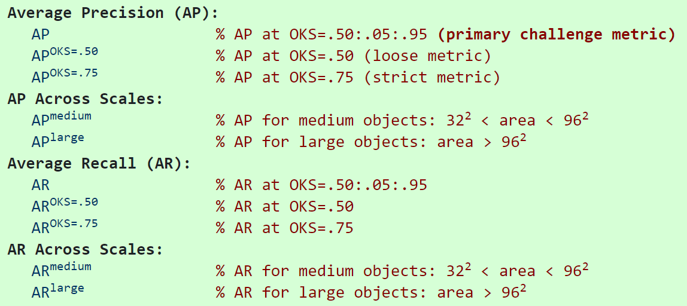

关键点检测的指标主要是OKS和PCK。其中OKS是现在的常用指标，PCK主要用在MPII等较老的数据集上，从OKS还衍生出AP和AR两个指标。

### OKS (Object Keypoint Similarity)

$$
OKS_p = \frac{\sum_i\exp(\frac{-d^2_{pi}}{2S^2_p\sigma^2_i})\delta(v_{pi}=1)}{\sum_i\delta(v_{pi}=1)}
$$

$p$ 表示`person id`

$i$表示 `keypoint id`

$d_{pi}$表示预测的关节点和标注的关节点的欧氏距离

$S_p$ 表示尺度缩放因子，$S_p=\sqrt{(x_2-x_1)(y_2-y_1)}$

$\sigma_i$ 表示第$i$个骨骼点的归一化因子，对数据集中所有groundtruth计算的标准差而得到的，反映出当前骨骼点标注时候的标准差， $\sigma_i$越大则越难标注

$v_{pi}$表示关节点是否可见

```python
def compute_oks(dts, gts):
    if len(dts) * len(gts) == 0:
        return np.array([])
    oks_mat = np.zeros((len(dts), len(gts)))

    # compute oks between each detection and ground truth object
    for j, gt in enumerate(gts):
        # create bounds for ignore regions(double the gt bbox)
        g = np.array(gt['keypoints'])
        xg = g[0::3]; yg = g[1::3]; vg = g[2::3]
        k1 = np.count_nonzero(vg > 0)
        bb = gt['bbox']
        x0 = bb[0] - bb[2]; x1 = bb[0] + bb[2] * 2
        y0 = bb[1] - bb[3]; y1 = bb[1] + bb[3] * 2
        for i, dt in enumerate(dts):
            d = np.array(dt['keypoints'])
            xd = d[0::3]; yd = d[1::3]
            if k1>0:
                # measure the per-keypoint distance if keypoints visible
                dx = xd - xg
                dy = yd - yg
            else:
                # measure minimum distance to keypoints in (x0,y0) & (x1,y1)
                z = np.zeros((len(sigmas)))
                dx = np.max((z, x0-xd),axis=0)+np.max((z, xd-x1),axis=0)
                dy = np.max((z, y0-yd),axis=0)+np.max((z, yd-y1),axis=0)
            e = (dx**2 + dy**2) / variances / (gt['area']+np.spacing(1)) / 2
            if k1 > 0:
                e=e[vg > 0]
            oks_mat[i, j] = np.sum(np.exp(-e)) / e.shape[0]
    return oks_mat
```


#### OKS 矩阵

对于多人姿态估计，若gt中M个人，预测了N个人，计算两两之间的OKS构成$M\times N$矩阵，最后选择每个gt的人中最大的OKS值作为结果。

### PCK (Percentage of Correct Keypoints)

$$
PCK_p^i=\frac{\sum_p\delta(\frac{d_{pi}}{d_{p}^{def}}\le T_i)}{\sum_p1}
$$

$p$ 表示`person id`

$i$表示 `keypoint id`

$d_{pi}$表示预测的关节点和标注的关节点的欧氏距离

$d_{p}^{def}$ 表示尺度缩放因子，对于FLIC使用的是躯干直径（左肩到左臀或右肩到左臀），对于MPII用的是头部对角线的长度（**PCKh**）

$T_i$ 表示第$i$个骨骼点的阈值

```python
def compute_pck_pckh(dt_kpts,gt_kpts,refer_kpts):
    """
    pck指标计算
    :param dt_kpts:算法检测输出的估计结果,shape=[n,h,w]=[行人数，２，关键点个数]
    :param gt_kpts: groundtruth人工标记结果,shape=[n,h,w]
    :param refer_kpts: 尺度因子，用于预测点与groundtruth的欧式距离的scale。
    　　　　　　　　　　　pck指标：躯干直径，左肩点－右臀点的欧式距离；
    　　　　　　　　　　　pckh指标：头部长度，头部rect的对角线欧式距离；
    :return: 相关指标
    """
    dt=np.array(dt_kpts)
    gt=np.array(gt_kpts)
    assert(len(refer_kpts)==2)
    assert(dt.shape[0]==gt.shape[0])
    ranges=np.arange(0.0,0.1,0.01)
    kpts_num=gt.shape[2]
    ped_num=gt.shape[0]
    #compute dist
    scale=np.sqrt(np.sum(np.square(gt[:,:,refer_kpts[0]]-gt[:,:,refer_kpts[1]]),1))
    dist=np.sqrt(np.sum(np.square(dt-gt),1))/np.tile(scale,(gt.shape[2],1)).T
    #compute pck
    pck = np.zeros([ranges.shape[0], gt.shape[2]+1])
    for idh,trh in enumerate(list(ranges)):
        for kpt_idx in range(kpts_num):
            pck[idh,kpt_idx] = 100*np.mean(dist[:,kpt_idx] <= trh)

        # compute average pck
        pck[idh,-1] = 100*np.mean(dist <= trh)
    return pck
```

PCK现在用的不多，主要用的是OKS

### AP（Average Precision）& AR（Average Recall）

AP和AR都是针对整个数据集而言的。在算Precision或者Recall之前，必然先要对关键点检测结果进行排序，很多文章都没有明确这里排序的依据是什么。从实现上来看，是根据人检测框的置信度高低进行排序的。

在计算AP和AR之前，先要画出$OKS=k$下的PR曲线。先对每个检测结果排序，然后计算从头到第k个结果时的Precision和Recall，就能画出PR曲线了，算出曲线下面积，在COCO中用的是11点采样法。Precision和Recall的计算方式如下所示：
$$
P=\frac{TP}{TP+FP}
$$
$$
R=\frac{TP}{TP+FN}
$$

对于多人关键点检测的任务，首先要做的是将检测到的结果`dt`和`gt`做匹配（$OKS \gt k$则为一对匹配，每个`dt`会和`OKS`最大的相匹配），那么就可能会出现有的`dt`没有与之相匹配的`gt`。从代码中可知，COCO中将TP定义为有匹配并且匹配到的不是`ignore`的`gt`，FP的定义为没有匹配的`gt`，$TP+FN$其实就是所有的`gt`个数（比如标注了100个instance，那么$TP+FN=100$）。

$OKS=k$下，$AP^{OKS=k}$就是此时采样后的Precision均值。$AP=\frac{1}{10}\sum_{k\in0.5:0.05:0.95}{AP^{OKS=k}}$，$AR$同理。

关于COCO上各个[指标](https://cocodataset.org/#keypoints-eval)的具体定义可以参考下图：



[人体姿态估计－评价指标（一）_ZXF_1991的博客-CSDN博客](https://blog.csdn.net/ZXF_1991/article/details/104279387)

[目标检测中的mAP是什么含义？ - 知乎](https://zhuanlan.zhihu.com/p/107989173)

[mAP for Object Detection](https://jonathan-hui.medium.com/map-mean-average-precision-for-object-detection-45c121a31173)