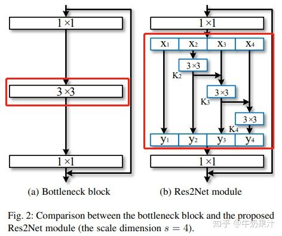

## CVPR-2020 UniPose: Unified Human Pose Estimation in Single Images and Videos

### WASP

WASP的结构如下图所示（实际上该作者还写过一篇论文`Waterfall Atrous Spatial Pooling Architecture for Efficient Semantic Segmentation`，单独写了这个WASP结构，用在语义分割上，这又写了一篇用在姿态识别，水论文么）

作者说是借鉴ASPP、Cascade和Res2Net。

简单来说，ASPP就是，对于同一个input，用不同dilation的卷积去运算，这样做的好处是在不改变计算量的前提下增大感受野，能够更好的捕捉不同尺度目标的信息。很显然，WASP里面那一行蓝色的就是借用了ASPP里的这一设计思路。

Res2Net，多尺度特征融合的一个新方法，而且是从一个更细的粒度上去进行多尺度特征融合。常见的方法例如FPN都是从层这个粒度上去融合多尺度特征的，但是Res2Net是从卷积运算的层面上去进行多尺度特征偶然那个和。需要注意的是，这里是把特征按通道来分成$s$等份（下图中$s=4$），然后每一组按照下述方法进行运算，例如$X_2$仅过$3\times3$卷积之后得到$K_2$，$K_2$和$X_3$加起来继续$3\times3$卷积，以此类推。可以看到对于不同组的特征，他们仅过卷积的次数是不一样的，那么感受野也就不一样，所以是不同尺度的特征融合。

个人理解Cascade和Res2Net指的都是WASP中每个卷积之间的横向箭头。

UniPose的整体架构如上图所示。输入一张图片，经过ResNet-101提取特征，然后再进过一个WASP模块提取不同尺度的特征，再进过Decoder将特征转化为热图。

其中的Decoder模块，结构也很简单，就是多个卷积层和Dropout的堆叠，最后用双线性插值上采样到输入大小。这里需要注意Decoder的输入，不仅仅是WASP的输出，还有来自ResNet-101的底层特征，特征融合的过程也比较常规。

### UniPose-LSTM

为了利用视频中的时序信息，作者有提出了UniPose-LSTM。其实也没什么特别的，就是用LSTM连起来。前一帧的heatmap和当前帧的heatmap作为LSTM的输入，经过几次卷积后得到最终的heatmap。但是作者这里没有明确前一帧和当前帧的heatmap是怎么结合在一起的，考虑到作者说参考的是`LSTM Pose Machine`，而`LSTM Pose Machine`里就是直接将两帧的特征concat，大胆猜测这里也是将前一帧和当前帧的heatmap做concat。

## CVPR-2018 LSTM Pose Machines

使用LSTM提取视频中的时序信息，改善视频中关节点预测的连续性，算是用到RNN较早的一篇论文了。模型结构如下图所示，对于第一帧图像，用较浅的ConvNet1得到一个热力图当作上一帧的输出，然后和当前帧通过ConvNet2得到的热力图加起来，再加上一个额外的Central Gaussian Map（CPM里用这个来提高准确率），合在一起作为LSTM的输入，然后LSTM的输出经过ConvNet3解码得到热力图。

ConvNet1、ConvNet2、ConvNet3和CPM中各个模型相同，LSTM用的是Conv-LSTM。主要的不同点在于把矩阵乘法换成了卷积。下面的公式里，$*$本来是矩阵乘法，在Conv-LSTM中是卷积（一般是$3\times3$卷积），目的是关注局部信息，全局信息可以用LSTM提取。
$$
\begin{align*}
g_t &= \tanh{(W_{xg}*X_t + W_{hg}*h_{t-1} + b_g)} \\
i_t &= \sigma{(W_{xi}*X_t + W_{hi}*h_{t-1} + b_i)} \\
f_t &= \sigma{(W_{xf}*X_t + W_{hf}*h_{t-1} + b_f)} \\
o_t &= \sigma{(W_{xo}*X_t + W_{ho}*h_{t-1} + b_o)} \\
C_t &= f_t \odot C_{t-1} + i_t \odot g_t \\
h_t &= o_t \odot \tanh{(C_t)}
\end{align*}
$$
