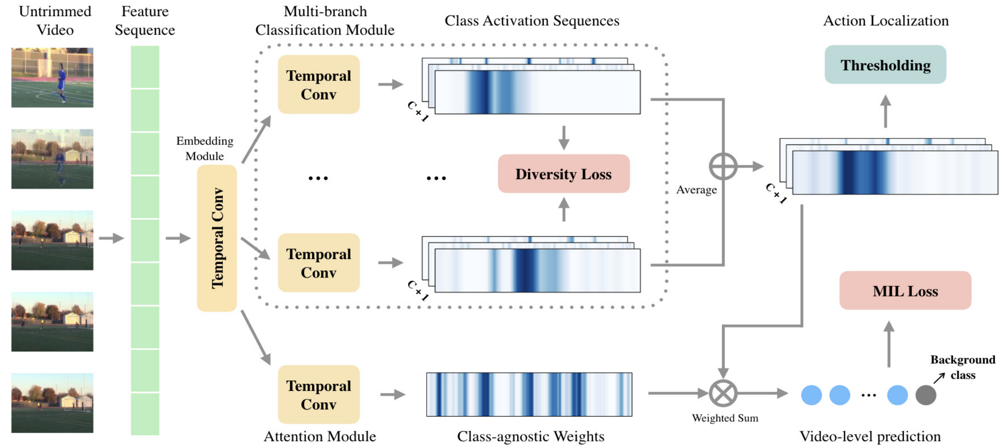

Action Localization 任务是对Action Recognition任务的提高版，不仅仅需要识别出视频中的是什么动作，还需要知道这个动作起始帧和终止帧的具体位置。如果是Action Recognition是图片分类的话，那么Action Localization就是目标检测，不仅仅要知道bounding box里面的是什么，还要知道这个bounding box应该画在哪里。

这里的弱监督指的是只标注了视频中包含什么行为（一个视频中可能包含**多个**行为），但是没有标注这个行为的起始帧和终止帧。也就是说，模型需要根据video-level的标注，回归得到每个行为具体发生的起止时间，相对来说这个任务更加困难。

## AAAI-2020 Background Suppression Network for Weakly-supervised Temporal Action Localization

### Weakly-supervised

有学者将`Weakly-supervised Action Localization`问题化归为`Multiple Instance Learning`。`MIL`，简单来说，就是一个集合中有多个实例，如果**每个**实例都是**负样本**，那么这个集合就是**负样本**；如果这个集合中**至少有一个正样本**，那么这个集合就是**正样本**，我们的任务是去预测每个集合的类别。因为视频是由一帧帧图像组成的，那么action localization就可以理解为是我找到一个视频片段，如果这个片段中至少有一帧包含我所关注的行为，那么我就认为这个片段是一个正样本（就所关注的行为而言），否则就是负样本，至于这个片段是否tight，那这个就需要其他方法来进一步优化了。

但本文的作者认为，视频中有大量帧是不包含任何感兴趣的动作的，如果不单独加入一个background的类，那这些没有任何感兴趣的动作的帧会被迫分类为某一个动作，这是不合适的，所以作者第一步就是加入了background这个类别。

这时候目标检测里所存在的类别不均衡的问题就出来，如果加入background，那么必然大多数帧都应该是background，这时候background和包含感兴趣的动作的帧的数量就会有很大的差异，导致类别不均衡。***（目标检测中的Focal Loss说不定可以一试？）***

针对这个问题，作者提出了使用Filter Module来找出background并过滤的方法来解决。

### Method

上图就是作者提出的BaSNet（**Ba**ckground **S**uppression **Net**work），左边的特征提取用的是I3D双流网络，特征提取部分不参与网络的训练。给定一个长度为$T$帧的视频片段，分别提取RGB和光流特征$R^{F\times T}$，拼接起来之后得到整个片段的特征$R^{2F\times T}$。

网络采用双分支的结构，第一个base branch和其他网络类似，通过一个$1\times 1$卷积得到`Class Activation Sequence(CAS)`。若数据集中一共有$C$个动作类别，那么得到的CAS就是$R^{(C+1)\times T}$，通道$i$都表示片段中每一帧包含动作$i$的得分，然后计算每个通道top-k的均值得到$R^{(C+1)}$，设就是`video-level class score`了；对于第二个Suppression branch，就是多了一个加权的过程，对片段的特征做两个$1\times 1$卷积，得到每帧不是background的概率，将这个概率和片段特征相乘之后再获得`CAS`，方法和base branch相同，并且卷积的参数是共享***（这也可以？？）***。

这里有一个小细节，在base branch，所有帧的background这个类都设置为1，而在suppression branch这都设置为0，作者说这是为了让suppression branch正确区分是否是background。

模型的损失是Binary Cross Entropy，就是每次判断是否是类别$i$，而不是去判断他是C类中的哪一个，这样可以降低其他类别的影响，适合于`Multi-label`的任务（`Multi-class`是指数据集中的样本可被分为2以上的类别，`Multi-label`是指数据集中每个样本可以属于多个不同的类别）。

最后设定阈值，超过阈值的认为是包含感兴趣的动作，然后把这些连起来就是一个候选动作区间。至于得到这些区间之后怎么继续下去，作者说和下面这篇论文一直。

## CVPR-2019 Completeness Modeling and Context Separation for Weakly Supervised Temporal Action Localization

主要针对两个问题，一是动作的完整性，比如上图上方射门的例子，包含运动员射门和球飞行两个自动做，作者通过设计多个不同的分支网络，让他们分别关注动作的不同部分，最后求均值来获取更好的CAS。二是动作的上下文和一般的background是不一样的，例如上图下方，台球桌对识别打台球的动作是有帮助的，而且通常出现在动作发生的前后，其分布是有一定规律的，但是background的分布是随机的，同时这些动作上下文也会干扰动作区间的检测，作者通过构造难例来解决。

### Method

上图是作者提出的模型结构，首先是提取视频特征$R^{T\times D}$，这里的$T$作者说是片段数（the number of snippets）。因为预训练的特征提取网络所提取的特征可能不完全适应action localization，所以添加一个Embedding层，得到特征$R^{T\times F}$。这个特征分别被被送到$K$分类分支中去，其实就是一个$1\times 1$卷积，然后再做`Softmax`得到CAS。为了防止这$K$各分支学习到相同（或极其相似）的信息，作者加入了一个diversity loss，其中$\overline{A^i_{\star,c}}$表示`Softmax`之后第$i$个branch的第$c$个类别的CAS
$$
\mathcal{L}_{div}=\frac{1}{K(K-1)(C+1)/2}\sum_{c=1}^{C+1}{\sum_{i=1}^{K-1}{\sum_{j=i+1}^{K}}{\frac{\overline{A^i_{\star,c}}\cdot\overline{A^j_{\star,c}}}{\Vert\overline{A^i_{\star,c}}\Vert\ \Vert\overline{A^j_{\star,c}}\Vert}}}
$$
实际上就是让各个分支之间CAS的相似度尽可能小，也就是说不同的branch要在不同的时刻得到较高的激活值，这就能解决动作完整性的，问题，相当于每个branch关注动作的不同部分，虽然单个来看是不够完整的，但是拼在一起就是一个好的结果。

作者通过实验观察到，往往会存在有一个branch值比较大，而其他branch的值接近于0，这样就会出现一个branch处于主导地位，这不是作者想要的；另一方面这$K$个branch就像是相互竞争，类似于GAN，所以要尽可能平很各个branch。为此，作者引入了一个另一个损失，降低每个branch中每个类的标准差***（没明白为什么要最小化标准差）***，其中$A^{avg}=\sum_{k=1}^K {A^k}$
$$
\mathcal{L}_{norm}=\frac{1}{K(C+1)}\sum_{c=1}^{C+1}{\sum_{i=1}^{K}}{|\Vert{A^i_{\star,c}}\Vert - \Vert{A^{avg}_{\star,c}}\Vert|}
$$
最后作者又加了一个简单的Attention来学习片段的重要性，再利用它加权得到视频中含有各个动作的概率：
$$
\overline{p}=softmax{\sum_{t=1}^T{att_tA^{avg}_{t,\star}}}
$$
上述这些模块就解决了动作完整性的问题，整体的损失函数为：
$$
\mathcal{L}=\alpha\mathcal{L}_{div}+\beta\mathcal{L}_{norm}+\mathcal{L}_{mil}
$$

### Localization

有点复杂。输入一个测试视频，得到它包含每个动作的概率，不考虑background，去掉所有包含这个动作的概率小于于0.1的CAS；在剩余的CAS中，利用$\overline{A^{avg}_{\star,c}}$作为阈值选出大于阈值的片段，然后这些片段就作为一个proposal。接下来使用一些公式来个每个片段打个分，实际上就是他同时考虑这个片段的CAS均值和这个片段附近的CAS均值***（可这个分有什么用呢？答：作为区间的置信度，用于NMS）***

## CVPR-2018 Weakly Supervised Action Localization by Sparse Temporal Pooling Network

作者认为行为可以通过识别视频中的一些关键片段来识别，所以作者提出了一个能够自动学习片段重要性的网络，并自动选择一个具有代表性的自己来识别视频中的行为。

每个视频被分为$T$个片段，每个以第$t$帧为中心的视频片段都被表示成特征$x_t\in R^m$，每个特征通过一个Attention Module得到一个该片段的权重值$\lambda_t$，根据这些权重值加权求和后得到视频级的特征$\overline{x}=\sum_{t=1}^T{\lambda_t x_t}$，这一视频级的特征被用来估计视频中包含每种动作的概率，并用多标签交叉熵损失函数来优化。而对学习得到的权重$\lambda=[\lambda_1, \lambda_2,\cdots, \lambda_T]$，为了能够让让模型自动选择具有代表性的子集，所以使用了L1正则化来增加$\lambda$的稀疏性。上述两个损失函数组合之后得到最终的损失函数：
$$
\mathcal{L}=\mathcal{L}_{class}+\beta\cdot\mathcal{L}_{sparsity}
$$
同时，作者提出了Temporal Class Activation Map（T-CAM），其实就是一个公式变换。注意每个片段的特征$x_t\in R^m$，公式里的$m$是特征维数。
$$
\begin{align*}
s^c&=\sum_{k=1}^m{w^c_k\overline{x}_k} \\
&=\sum_{k=1}^m{w^c_k\sum_{t=1}^T{\lambda_t x_{t,k}}} \\
&=\sum_{t=1}^T{\lambda_t\sum_{k=1}^m{w^c_k x_{t,k}}}
\end{align*}
$$

作者说他的T-CAM可以表示为$a_t=(a_t^1,a_t^2,\cdots,a_t^T)^T$，其中$a_t^c=\sum_{k=1}^m{w^c_k x_{t,k}}$***（这一步实现还是挺有意思的，作者在测试的时候直接获取了全连接层的权重矩阵）***

### Localization

以RGB为例，那么首先根据每个片段的权重值得到加权后的T-CAM
$$
\psi_t^c=\lambda_t\cdot sigmoid(a_t^c)
$$
记者就是普通的阈值法获得temporal proposal，每个proposal可以表示为$[t_{start}, t_{end}, score]$，score的计算公式如下：
$$
\sum_{t=t_{start}}^{t_{end}}{\lambda_{t,\star}\frac{\alpha \cdot a_{t,RGB}^{c}+(1-\alpha)\cdot a_{t,FLOW}^{c}}{t_{end} - t_{start} + 1}}
$$
实际上就是对这个proposal中的T-CAM加权求和，再做一些归一化（去除proposal长度不同带来的影响）。这个score用在NMS，以前的方法是直接选最长的一个proposal，显然不够合理。

## ICCV-2019 Weakly Supervised Temporal Action Localization through Contrast based Evaluation Networks

## CVPR-2017 UntrimmedNets for Weakly Supervised Action Recognition and Detection

首先是片段采样，作者提出了两种采样方法。第一种是均匀采样，把一个视频分成等长的$N$段，但是这种采样方式没有考虑到动作的连续性和一致性，因此生成的proposal可能是不够准确的；第二种采样方法是基于shot（镜头？）的采样，作者使用每帧的HOG特征的差值来划分shot。计算每帧图像的HOG特征，如果相邻帧之间HOG特征的差值超过了阈值，那么就是上一个shot的结束，下一个shot的开始。然后对每一个shot，每个连续$K$帧都是一个proposal。

对每个proposal，使用TSN和双流CNN分别提取特征，比较常规，输入的构造方法和原模型一致。

分类模块很简单，就是一个全连接层再加一个softmax，得到每个proposal包含某个动作的概率，其中$C$表示动作类别的个数，$\phi(p)$表示第$p$个proposal的特征：
$$
\begin{align*}
\mbox{x}^c(p)&=W^c\phi(p)\\
\mbox{x}^c(p)&=[x^c_1(p),x^c_2(p),\cdots]\\
\overline{x}^c_i(p)&=\frac{\exp(x^c_i(p))}{\sum_{k=1}^C\exp(x^c_k(p))}
\end{align*}
$$
接下来就是选择模块，选择出最有可能包含动作的proposal，作业也提出了两种方法。首先是hard selection，对每个动作类别，分别选出得分（这里用的是softmax之前的值）最高的$k$个proposal；第二个是soft selection，其实就是标准的attention，是一个跨clip的融合吧。
$$
\begin{align*}
x^s(p)&={w^c}^T\phi(p)\\
\overline{x}^s(p)&=\frac{\exp(x^s(p))}{\sum_{k=1}^C\exp(x^s(k))}
\end{align*}
$$
接着就是融合了，soft selection就根据$\overline{x}^s(p)$来融合，hard selection因为没有做softmax，就再做一次softmax
$$
\begin{align*}
x_i^p(V)&=\sum_{n=1}^{N}{x^s_i(n)x_i^c(n)} \\
\overline{x}_i^p(V)&=\frac{\exp(x_i^r(V))}{\sum_{k=1}^C\exp(x_k^r(V))} \\
x_i^p(V)&=\sum_{n=1}^{N}{\overline{x}^s(n)x_i^c(n)}
\end{align*}
$$

文中上下标混乱不堪，看懂意思就行了吧。

## ECCV-2018 Weakly-supervised Temporal Action Localization in Untrimmed Videos

## ECCV-2018 W-TALC: Weakly Supervised Temporal Activity Localization and Classification